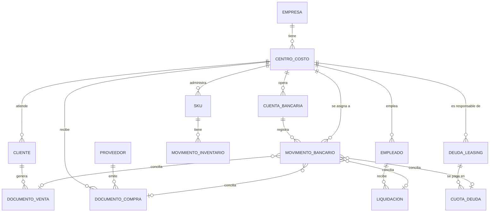

# Modelo de datos

*Los nombres de entidades y campos siguen el [glosario de lenguaje de negocio](../00-vision-y-negocio/glosario-lenguaje-negocio.md). Motor de base de datos: PostgreSQL (ver [ADR-003](../01-arquitectura/decisiones-tecnicas-ADR.md)).*

## Cómo leer este documento

Cada entidad se marca con la fase en que se necesita, para no construir tablas que no se van a usar todavía:

- **Fase 1 (MVP)**: `empresa`, `centro_costo`, `cuenta_bancaria`, `movimiento_bancario` — lo mínimo para el primer producto funcionando (movimientos bancarios por centro de costo).
- **Fase 2+**: el resto de las entidades, que se activan a medida que se construyen los módulos de CRM, inventario, remuneraciones y deuda (ver [roadmap](../04-roadmap/roadmap.md)).

## Diagrama entidad-relación

## Entidades — Fase 1 (MVP)

### `empresa`

| Campo | Tipo | Notas |
|---|---|---|
| `id` | UUID (PK) | |
| `rut` | varchar(12) | RUT de la empresa, único |
| `razon_social` | varchar(200) | |
| `creado_en` | timestamp | |

### `centro_costo`

| Campo | Tipo | Notas |
|---|---|---|
| `id` | UUID (PK) | |
| `empresa_id` | UUID (FK → empresa) | |
| `nombre` | varchar(100) | ej. "Sucursal Providencia" |
| `tipo` | enum: `sucursal`, `unidad_negocio`, `overhead` | ver [glosario](../00-vision-y-negocio/glosario-lenguaje-negocio.md) |
| `centro_costo_padre_id` | UUID (FK → centro_costo, nullable) | permite jerarquía (unidad de negocio → sucursales) |
| `regla_prorrateo` | enum nullable: `porcentaje_venta`, `headcount`, `metros_cuadrados`, `monto_fijo` | solo aplica si `tipo = overhead` |
| `activo` | boolean | default true |

### `cuenta_bancaria`

| Campo | Tipo | Notas |
|---|---|---|
| `id` | UUID (PK) | |
| `empresa_id` | UUID (FK → empresa) | |
| `centro_costo_id` | UUID (FK → centro_costo, nullable) | nullable porque una cuenta puede ser transversal a varias sucursales |
| `banco` | varchar(50) | ej. "Banco de Chile" |
| `numero_cuenta` | varchar(30) | |
| `tipo_cuenta` | enum: `corriente`, `vista`, `linea_credito` | |
| `id_externo_agregador` | varchar(100) | id que entrega Fintoc (u otro agregador) para esta cuenta — ver [ADR-001](../01-arquitectura/decisiones-tecnicas-ADR.md) |
| `saldo_actual` | numeric(14,2) | se actualiza en cada sincronización |
| `ultima_sincronizacion` | timestamp | |

### `movimiento_bancario`

| Campo | Tipo | Notas |
|---|---|---|
| `id` | UUID (PK) | |
| `cuenta_bancaria_id` | UUID (FK → cuenta_bancaria) | |
| `centro_costo_id` | UUID (FK → centro_costo, nullable) | se completa al conciliar si la cuenta es transversal |
| `fecha` | date | |
| `monto` | numeric(14,2) | positivo = abono, negativo = cargo (o usar campo `tipo` separado, a decidir en implementación) |
| `tipo` | enum: `cargo`, `abono` | |
| `glosa` | varchar(255) | descripción tal cual la entrega el banco |
| `id_externo_agregador` | varchar(100) | id del movimiento en el agregador, para evitar duplicados al resincronizar |
| `estado_conciliacion` | enum: `pendiente`, `conciliado_automatico`, `conciliado_manual`, `sin_conciliar` | ver [glosario](../00-vision-y-negocio/glosario-lenguaje-negocio.md) |
| `tipo_conciliacion` | enum nullable: `venta`, `compra`, `remuneracion`, `deuda`, `gasto_directo` | a qué tipo de documento se conectó |
| `documento_conciliado_id` | UUID nullable | id del documento de venta/compra/liquidación/cuota conciliado (referencia polimórfica — en la implementación se resuelve con una tabla de conciliación aparte o con columnas nullable por tipo, a decidir en el manual de desarrollo) |

## Entidades — Fase 2+ (se documentan ahora, se construyen después)

### `cliente`

| Campo | Tipo | Notas |
|---|---|---|
| `id` | UUID (PK) | |
| `centro_costo_id` | UUID (FK → centro_costo) | sucursal donde se originó el cliente |
| `rut` | varchar(12) | |
| `nombre` | varchar(200) | |
| `vendedor` | varchar(100) | nullable |

### `documento_venta`

| Campo | Tipo | Notas |
|---|---|---|
| `id` | UUID (PK) | |
| `cliente_id` | UUID (FK → cliente) | |
| `centro_costo_id` | UUID (FK → centro_costo) | |
| `folio` | varchar(30) | folio del DTE |
| `tipo_dte` | enum: `boleta`, `factura`, `nota_credito`, `nota_debito` | |
| `monto` | numeric(14,2) | |
| `fecha_emision` | date | |
| `estado_cobro` | enum: `facturado`, `cobrado`, `vencido` | "cobrado" solo se marca cuando concilia con `movimiento_bancario` |

### `proveedor`

| Campo | Tipo | Notas |
|---|---|---|
| `id` | UUID (PK) | |
| `rut` | varchar(12) | |
| `nombre` | varchar(200) | |
| `categoria_gasto` | varchar(50) | ej. "arriendo", "insumos", "marketing" |

### `documento_compra`

| Campo | Tipo | Notas |
|---|---|---|
| `id` | UUID (PK) | |
| `proveedor_id` | UUID (FK → proveedor) | |
| `centro_costo_id` | UUID (FK → centro_costo) | |
| `folio` | varchar(30) | |
| `tipo_dte` | enum: `factura_compra`, `nota_credito`, `nota_debito` | |
| `monto` | numeric(14,2) | |
| `fecha_emision` | date | |
| `estado_pago` | enum: `pendiente`, `pagado`, `vencido` | |

### `sku`

| Campo | Tipo | Notas |
|---|---|---|
| `id` | UUID (PK) | |
| `codigo` | varchar(50) | único |
| `descripcion` | varchar(200) | |
| `costo_promedio` | numeric(14,2) | PMP, se recalcula en cada entrada — ver [glosario](../00-vision-y-negocio/glosario-lenguaje-negocio.md) |

### `movimiento_inventario`

| Campo | Tipo | Notas |
|---|---|---|
| `id` | UUID (PK) | |
| `sku_id` | UUID (FK → sku) | |
| `centro_costo_id` | UUID (FK → centro_costo) | sucursal donde ocurre el movimiento |
| `tipo` | enum: `entrada`, `salida`, `merma`, `traspaso` | |
| `cantidad` | numeric(12,2) | |
| `fecha` | date | |
| `documento_relacionado_id` | UUID nullable | referencia a `documento_compra` o `documento_venta` según corresponda |

### `empleado`

| Campo | Tipo | Notas |
|---|---|---|
| `id` | UUID (PK) | |
| `centro_costo_id` | UUID (FK → centro_costo) | |
| `rut` | varchar(12) | |
| `nombre` | varchar(200) | |
| `cargo` | varchar(100) | |
| `id_externo_buk_talana` | varchar(100) | id del empleado en BUK o Talana |

### `liquidacion`

| Campo | Tipo | Notas |
|---|---|---|
| `id` | UUID (PK) | |
| `empleado_id` | UUID (FK → empleado) | |
| `periodo` | varchar(7) | formato `AAAA-MM` |
| `sueldo_liquido` | numeric(14,2) | |
| `sueldo_imponible` | numeric(14,2) | |
| `cotizaciones` | numeric(14,2) | suma AFP + isapre/Fonasa + otros |
| `estado_pago` | enum: `pendiente`, `pagado` | se marca "pagado" al conciliar con `movimiento_bancario` |

### `deuda_leasing`

| Campo | Tipo | Notas |
|---|---|---|
| `id` | UUID (PK) | |
| `centro_costo_id` | UUID (FK → centro_costo, nullable) | nullable si la deuda es a nivel empresa completa |
| `tipo` | enum: `credito_comercial`, `linea_credito`, `leasing_financiero`, `leasing_operativo`, `factoring` | |
| `acreedor` | varchar(100) | banco o empresa de leasing |
| `monto_original` | numeric(14,2) | |
| `tasa_interes` | numeric(6,4) | |
| `plazo_meses` | integer | |
| `fecha_inicio` | date | |

### `cuota_deuda`

| Campo | Tipo | Notas |
|---|---|---|
| `id` | UUID (PK) | |
| `deuda_leasing_id` | UUID (FK → deuda_leasing) | |
| `numero_cuota` | integer | |
| `fecha_vencimiento` | date | |
| `capital` | numeric(14,2) | |
| `interes` | numeric(14,2) | |
| `estado_pago` | enum: `pendiente`, `pagado`, `vencido` | se marca "pagado" al conciliar con `movimiento_bancario` |

## Nota sobre la conciliación polimórfica

`movimiento_bancario.documento_conciliado_id` puede apuntar a distintos tipos de documento (`documento_venta`, `documento_compra`, `liquidacion`, `cuota_deuda`). Postgres no tiene llaves foráneas polimórficas nativas; en el manual de desarrollo se decidirá entre dos enfoques estándar: una tabla `conciliacion` intermedia (recomendado, más limpio) o columnas nullable separadas por tipo de documento en `movimiento_bancario` (más simple de entender al empezar, pero menos prolijo). Esta decisión se registrará como un ADR nuevo cuando se aborde el módulo de conciliación en el manual de desarrollo.
